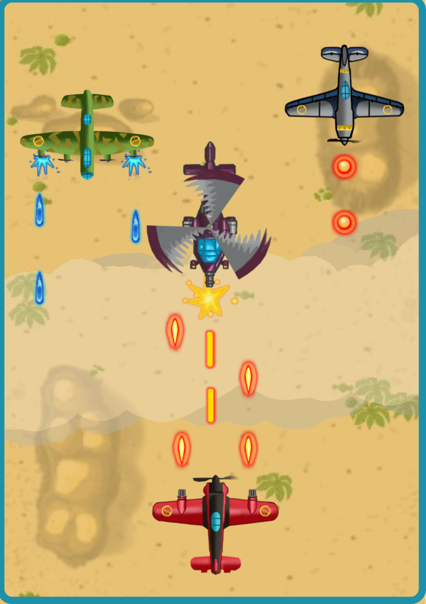

# Aeroblasters

[](https://forthebadge.com)
[](https://forthebadge.com)
[](https://forthebadge.com)


Aeroblasters is a simple 2d vertical plane shooter game made using python and pygame. The game can  be run both on pc or android using pydroid3.

Install pydroid3 on Android from here : [pydroid3 playstore](https://play.google.com/store/apps/details?id=ru.iiec.pydroid3&hl=en_IN&gl=US)

<p align='center'>
  
</p>

## How to Download

Download this project from here [Download Aeroblasters](https://downgit.github.io/#/home?url=https://github.com/pyGuru123/Python-Games/tree/master/Aeroblasters)

## Requirements

Use the package manager [pip](https://pip.pypa.io/en/stable/) to install following packages :-
* Pygame

```bash
pip install pygame
```

pygame is already installed in pydroid3, no installation required.

## Usage

Navigate and click main.py to run the game. Then tap on the screen to start playing the game. The objective of the game is to destroy as much enemy planes or choppers as possible without getting destroyed. 

Controls:
* Press left arrow key to go left
* Press right arrow key to go right
* Press space key to go shoot
* Press esc key to quit

When playing with mouse or on pydroid3
* Press left half of game window to go left
* Press right half of game window to go right
* Click on player plane to shoot

## Contributing
Pull requests are welcome. For major changes, please open an issue first to discuss what you would like to change.

Please make sure to update tests as appropriate.