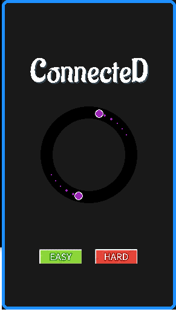

# Connected

[](https://forthebadge.com)
[](https://forthebadge.com)
[](https://forthebadge.com)

Connected is a simple endless hypercasual arcade game made with pygame.

<p align='center'>
	
</p>
## How to Download

Download this project from here [Download Connected](https://downgit.github.io/#/home?url=https://github.com/pyGuru123/Python-Games/tree/master/Connected)

## Requirements

Use the package manager [pip](https://pip.pypa.io/en/stable/) to install following packages :-
* Pygame

```bash
pip install pygame
```

## Usage

Navigate and click main.py to open the game, Tap on easy or hard tp select level. The objective of the game is to collect incoming squares without colliding with incoming rects.

Controls:
* Tap anywhere to flip direction.
* press ESC to escape the game

## Contributing

Pull requests are welcome. For major changes, please open an issue first to discuss what you would like to change.

Please make sure to update tests as appropriate.