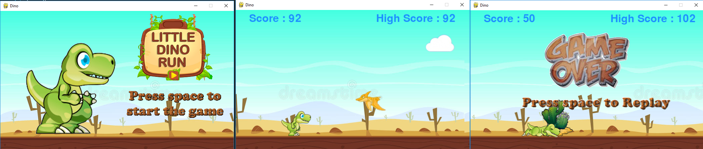

# Dino Run

[](https://forthebadge.com)
[](https://forthebadge.com)
[](https://forthebadge.com)

Dino Run is simple modified version of Google Chrome dino made with python and pygame.

<p align='center'>
	
</p>

## How to Download

Download this project from here [Download Dino Run](https://downgit.github.io/#/home?url=https://github.com/pyGuru123/Python-Games/tree/master/Dino)

## Requirements

Use the package manager [pip](https://pip.pypa.io/en/stable/) to install following packages :-
* Pygame

```bash
pip install pygame
```

## Usage

Double click the main.py to open the game. The objective of the game is to dodge incoming cactus and pteras in order to create high score.

Controls:
* Press Space or Up arrow key to jump.
* Press Down arrow key to duck.
* Press space on end page to restart the game.
* Press escape or q key to end the game.

## Contributing

Pull requests are welcome. For major changes, please open an issue first to discuss what you would like to change.

Please make sure to update tests as appropriate.