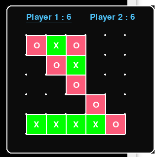

# Dots & Boxes

[](https://forthebadge.com)
[](https://forthebadge.com)
[](https://forthebadge.com)

Dots & Boxes is a simple 2 player board game made with python and pygame.

<p align='center'>
	
</p>

## How to Download

Download this project from here [Download Tetris](https://downgit.github.io/#/home?url=https://github.com/pyGuru123/Python-Games/tree/master/Dots%20%26%20Boxes)

## Requirements

Use the package manager [pip](https://pip.pypa.io/en/stable/) to install following packages :-
* Pygame

```bash
pip install pygame
```

## Usage

Double click the main.py to open the game, Select any block and start playing the game

Controls:
* Use Cursor to select a cell
* Use Arrow keys to draw the borders respectively.
* Use Esc to quit the game.

## Contributing

Pull requests are welcome. For major changes, please open an issue first to discuss what you would like to change.

Please make sure to update tests as appropriate.