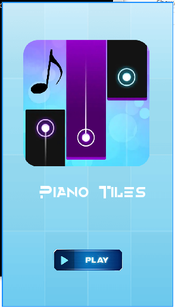

# Piano Tiles

[](https://forthebadge.com)
[](https://forthebadge.com)
[](https://forthebadge.com)

Piano Tiles is a piano tiles musical game implementaion in python and pygame.

<p align='center'>
	
</p>

## How to Download

Download this project from here [Download Piano Tiles](https://downgit.github.io/#/home?url=https://github.com/pyGuru123/Python-Games/tree/master/Piano%20Tiles)

## Requirements

Use the package manager [pip](https://pip.pypa.io/en/stable/) to install following packages :-
* Pygame

```bash
pip install pygame
```

## Usage

Double click the game.py to open the game, Click start to start playing the game. The objective of the game is to click the tiles to without clicking anywhere else inthe game screen to generate musical notes. Also if a block reaches ground without getting clicked, game will get over.

Controls:
* Use Mousemotion to move & Left Mouse key to click tiles. 

## Contributing

Pull requests are welcome. For major changes, please open an issue first to discuss what you would like to change.

Please make sure to update tests as appropriate.